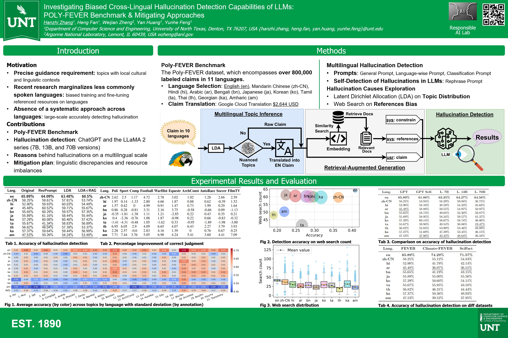

This poster has been selected to receive an outstanding poster award on **the 1st place**! As a winner of the Engineering Showcase Poster Presentation, Hanzhi Zhang have been selected to represent College of Engineering to present at the [University Research Day annual poster session](https://research.unt.edu/events/research-day-2024/poster-session-2024). 

